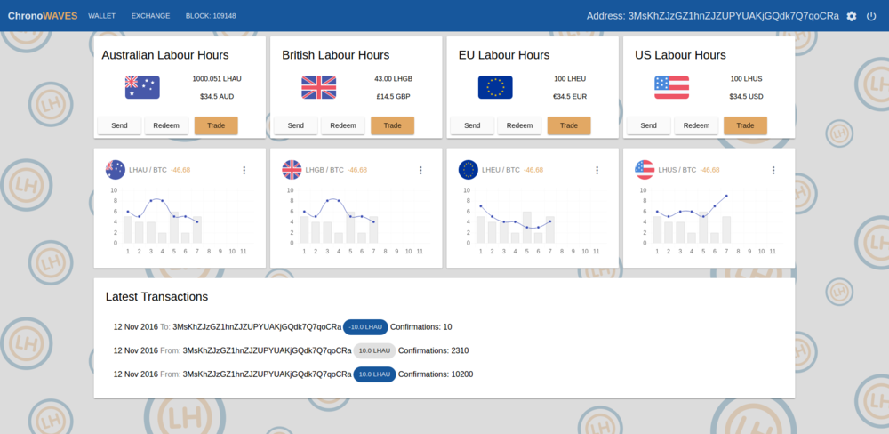

# ChronoWAVES  

Chrono Wallet (Lite Client) for Waves Platform

## Features
- Advanced lite client tightly integrated with Chronobank Platform
- Builtin support for Labour-Hours tokens issued on Waves Blockchain
- Integration with Waves Decentralised Assets Exchange (DEX)
- Compatible with original Waves Lite Client
- Integration with Chronobank Gateways
- Based on waves-ts framework completely written in Typescript

## Contact  

Help us develop the application by submitting issues and bugs.
